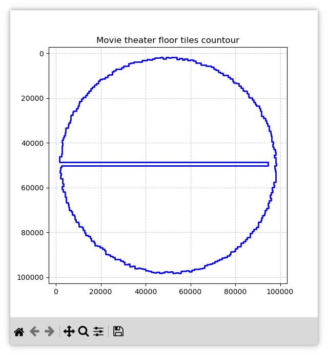
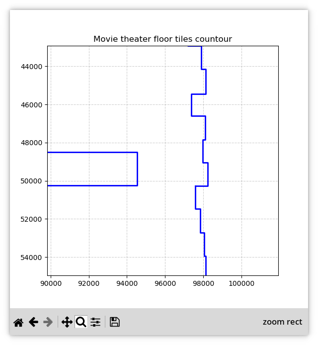
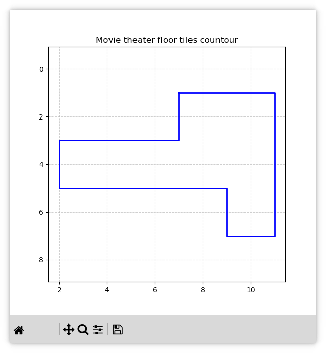
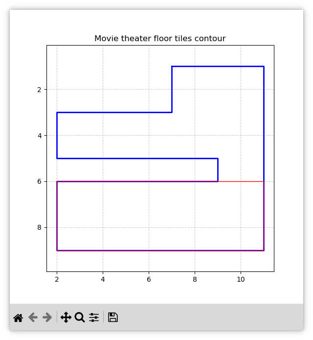
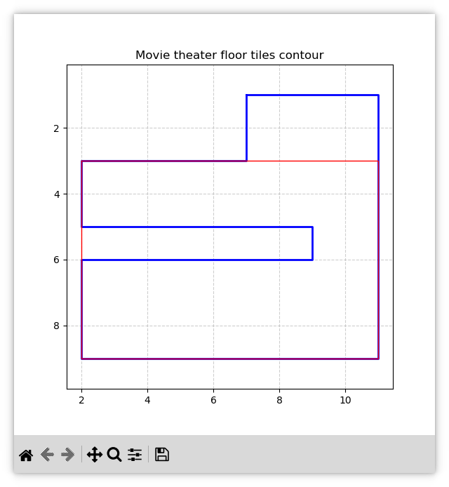

# Day 9: Movie Theater

## Part 1

Here we just loop through every pair of tiles and calculate the maximum area of the rectangles they form.

The area in this puzzle is the number of tiles inside the rectangle, not the geometric area. Since the tiles form a grid, a rectangle between (*x*₁, *y*₁) and (*x*₂, *y*₂) contains (|*x*₂ - *x*₁| + 1) × (|*y*₂ - *y*₁| + 1) tiles.

```c++
for (std::size_t i = 0; i < ntiles; i++) {
	for (std::size_t j = i+1; j < ntiles; j++) {
		auto area =
			static_cast<i64>(std::abs(tiles[i][0] - tiles[j][0]) + 1) *
			static_cast<i64>(std::abs(tiles[i][1] - tiles[j][1]) + 1);
		result = std::max(result, area);
	}
}
```

**Complexity estimation**

We check every pair of tiles, so the complexity is *O*(*N*²), where *N* is the number of tiles. For the given input, this runs in milliseconds.

## Part 2

### Obvious solution

With the [Boost Geometry library](https://www.boost.org/doc/libs/latest/libs/geometry/doc/html/index.html), this part is nearly as simple as Part 1. Indeed, we again iterate over all pairs of tiles, select only those that form a rectangle fully covered by the polygon formed by the red and green tiles, and return the maximum area among the valid rectangles.

The task was trivial and boring, so I asked an AI to generate the code for this part. After three iterations, it produced [`09-2-boost.cpp`](../09-2-boost.cpp), which gives the correct answer. The code could have been more concise if the AI hadn't run into integer overflow. I should have told it to use `i64` beforehand.

However, I made this AI-generated solution after I had already crafted a hand-made one. Using `covered_by` from Boost.Geometry was the obvious approach, but I wanted to see if I could make it through without external libraries.

### First bruises

Without Boost Geometry, the puzzle turns into a not-so-trivial problem. However, there was still hope.

Here is a picture of the colored contour for the sample input.

```
..............
.......#XXX#..
.......X...X..
..#XXXX#...X..
..X........X..
..#XXXXXX#.X..
.........X.X..
.........#X#..
..............
```

It looks "convex". A convex figure contains all points of the straight line segments between any two points belonging to it. If we restrict the term "straight line" to only the allowed movements—i.e., vertical or horizontal—then under this restriction, the sample could be considered an HV-convex polyomino (see section 3 of [this](https://ar5iv.labs.arxiv.org/html/2004.07354) article). Since the figure enclosed by the input line is a polyomino by the puzzle statement, further we will refer to such a property simply as HV-convexity.

If the main input were HV-convex, too, the task would be tons easier. Indeed, we could simply check whether all four vertices of a rectangle lie inside the contour; that would be enough to deduce that the whole rectangle also lies inside. Two of those points by definition belong to the contour. We must check only the remaining two.

Checking that a single point *P* lies inside the polyomino is quite easy. It's enough to find a couple of, say, vertical segments *V*₁ and *V*₂ with the following properties:

* *P*'s Y-coordinate lies within the intervals of the end Y-coordinates of both segments.
* *P*'s X-coordinate lies within the interval between *V*₁'s X-coordinate and *V*₂'s X-coordinate.

```
    V₁

    #
    X
    X                V₂
    X
    X<--------P----->#
    X----------------X
    X----------------X
    #----------------X
                     X
                     X
                     #
```

In the picture, *P* lies between two vertical segments. The horizontal line from *P* to the right border also lies inside the contour, which is exactly the property we need: under HV-convexity, the whole rectangle between *P* and any other point of the contour is inside.

That's it! We could even sort the segments by their upper ends to speed up the search a little.

So I tried to check the main input for HV-convexity. I wrote a script [`09-check-hvconvexity.py`](../09-check-hvconvexity.py) that takes an input file as its argument. The check for HV-convexity is simple. At each step, the path turns left or right. To tell left from right, we take two segments forming a turn and compute their cross product. If the product's sign is negative, it's a right turn (remember, the Y-coordinate grows downward); otherwise it's a left turn.

We compute the difference between the numbers of left and right turns. It must be exactly 4 for a closed contour, since we end up at the starting point after a full 360° rotation (either left or right). Additionally, if our HV-convex path is right-oriented, it is allowed to have no more than one consecutive left turn and no more than four consecutive right turns. The same applies to a left-oriented HV-convex figure, but with left and right swapped.

Here is a picture that illustrates the difference. We start at the vertex `(7, 1)` and walk clockwise, counting consecutive turns in one direction.

```
HV-convex         Not HV-convex
................    ................
........R₁......    ........R₁......
start->.#XXX#R₂.    start->.#XXX#R₂.
........X...X...    ........X...X...
.R₂#XXXX#L₁.X...    .R₂#XXXX#L₁.X...
...X........X...    ...X........X...
...X......L₁X...    ...X......L₂X...
.R₁#XXXXXX#.X...    .R₁#XXXXXX#.X...
..........X.X...    ..........X.X...
..........X.X...    ...R₅#XXXX#.X...
..........X.X...    .....X...L₁.X...
........R₄#X#...    ...R₄#XXXXXX#...
............R₃..    ............R₃..
................    ................
```

On the left, the figure is HV-convex: at most 4 right turns in a row and at most 1 left turn in a row. On the right, the figure is not HV-convex: there are 5 right turns in a row and 2 left turns in a row.

Alas, the main input turned out not to be HV-convex. This bad news led me later to a serious mistake.

### Drawing a circular path

We can still cope with a non-HV-convex contour by applying the following strategy. First, we check that no segment of the contour crosses the interior (excluding the borders) of a rectangle being tested. Then we may choose a point strictly inside the rectangle and trace the entire contour, measuring the total angle swept around the point. If the point is inside the contour formed by the path, the whole rectangle is valid. A point is inside the contour if, while traversing the contour, we make a full circle around it.

We start at the beginning of the path, measure the angle between the first red tile, the point of interest, and the second point. We make one step along the path, measure the next angle, and add it to the previous one. In the end, we will either get a 360° total angle, which means a full circle, or 0°, meaning the contour somehow went around the point without enclosing it.

It's a valid solution, but it looked too cumbersome to me for a one-day puzzle, so I gave up on it and returned to the puzzle statement.

### Over-complication out of the blue

I carefully reread the puzzle statement twice. It said that the only guarantee is that the path always turns left or right at each red tile. Nothing is said about the number of turns. Moreover, nothing is said about how far apart the segments may lie. For instance, here is an absolutely legit input:

```
.#XXXX#
.X....X
.X.#XX#
.X.#XX#
.X....#
.#XXXX#
```

When we flood-fill it with green, the result is:

```
.#XXXX#
.XXXXXX
.XX#XX#
.XX#XX#
.XXXXX#
.#XXXX#
```

The whole big rectangle is a valid solution because those two middle segments are vertically adjacent. This means that under certain conditions, a valid rectangle may cross the contour. However, the puzzle author didn't mean that at all!


### Drawing pictures

It's the first (and the last for the 2025 event) time I resorted to visualizing the input data. You can use script [`09-vis.py`](../09-vis.py) for this. Its first argument is a puzzle input. The second optional argument is a file containing the rectangle (the answer) containing four coordinates: bottom, left, top, right. The input contour is drawn in blue, and the answer is drawn in red.

The script requires Python 3 and `matplotlib`. Install the latter with `pip install matplotlib`. This dependency is not mentioned in the README because it does not affect the build of the C++ solutions, and all the necessary pictures are already here in this write-up.

The picture gave a gloomy prospect. Here it is.



Let's zoom in on it near the middle of the right border.



Compare it to the sample input.



The figure in the main input has plenty of cavities, and additionally a big one in the center. Things started looking dark.

### Calling for help from brute force

Let's try the other extreme and just flood fill the whole contour tile by tile. However there are two aspects which, combined, render this approach barely fruitful.

First, the input figure is about 100,000 by 100,000, which gives about 10 billion tiles. If every tile is encoded as a `char`, the whole field would require 9+ GiB of memory, and who knows how quickly we could check every rectangle against this amount of data. Even encoding a tile as a single bit would reduce the memory consumption to no less than 1 GiB. That's not much help.

The second aspect is much worse. It turns out that the problem cannot be solved by a one-dimensional algorithm. For instance, consider some row in the middle of the grid. It might look like this:

```
..#???#?????#???#.
```

Here, the question marks denote non-red tiles of interest. Should we paint them green or, say, leave them "gray"? There is no answer until we know what lies right above this row. It could be this:

```
..XXXXX.....XXXXX.    ..XXXXX.....XXXXX.
..#???#?????#???#. -> ..#XXX#.....#XXX#.
..................    ..................
```

or this:

```
..XXXXXXXXXXXXXXX.    ..XXXXXXXXXXXXXXX.
..#???#?????#???#. -> ..#XXX#XXXXX#XXX#.
......XXXXXXX.....    ......XXXXXXX.....
```

This is what pushed me towards an analytical solution in 2-D, rather than a pixel-by-pixel fill.

### Turning to 2-D

If the problem cannot be solved in 1-D, we can rethink it as a problem of splitting the whole field into a set of non-intersecting rectangles, some of them filled in green (and a bit red) and others staying "gray".

We will need only the set of horizontal segments of our contour, since the vertical ones can be easily restored from them. We start with a singular empty rectangle spanning the whole world with coordinates `{left: -Infinity, right: +Infinity, bottom: -Infinity, top: +Infinity}`. This time, we don't bother with the direction of the Y-axis and treat the bottom as the horizontal side with the minimal Y-coordinate.

We go from bottom to top and pick the closest horizontal segment. If a segment intersects a rectangle, it divides that rectangle into at most four rectangles: left, right, fixed, and new.

```
   +-------+------------------+-------+
   |       |                  |       |
   |       |      fixed       |       |
   |       |                  |       |
   | left  #XXXXXXXXXXXXXXXXXX# right |
   |       |                  |       |
   |       |       new        |       |
   |       |                  |       |
   \/\/\/\/\/\/\/\/\/\/\/\/\/\/\/\/\/\/   <- continues to +Inf
```

The picture does not yet show which borders belong to which blocks—we will sort that out below.

Here, the segment is denoted by a line of `#` and `X` symbols. Left and right are the untouched parts of the original rectangle: the segment does not reach their boundaries, so they continue downwards to +Inf. The fixed rectangle is the part of the original rectangle above the segment. Its left, right, bottom, and top borders are now defined. The new rectangle is the continuation of the fixed one below the segment, and it continues downwards to +Inf.

Let's introduce some notation. The rectangle being split has borders *L*, *R*, *B*, *T*. Since we go bottom-up, the *T* border is always at +Inf. The splitting segment has coordinates *l*, *r*, and *y* (its Y-coordinate).

Here are the rules for splitting and merging rectangles. They emerge from the fact that if a vertical or horizontal segment splits a filled and an empty rectangle, the part of the segment belongs to the filled rectangle.

1. If the rectangle being split is filled and has only one common point with the segment, either on the left or on the right border, then it is actually a border junction and there is no split.
2. If the rectangle being split is empty, then:
   * If *l* > *L*, then we have a left rectangle with borders: *L*, *l* - 1, *B*, *T*.
   * If *r* < *R*, then we have a right rectangle with borders: *r* + 1, *R*, *B*, *T*.
   * The rectangle being fixed fits horizontally between the left and right rectangles (if they exist), or spans to the left or right border (or both) of the initial rectangle. Its bottom border is *B*, and its top border is *y* - 1. If *y* < *B*, the fixed rectangle does not exist. This handles the case when two segments are vertically adjacent.
   * Similarly, the new rectangle fits horizontally between the left and right and gets bottom border *y* and top border *T*.
   * The left, right, and fixed rectangles are set as empty, while the new rectangle is filled.
3. If the rectangle being split is filled, then:
   * If *l* >= *L*, then we have a left rectangle with borders: *L*, *l*, *B*, *T*.
   * If *r* <= *R*, then we have a right rectangle with borders: *r*, *R*, *B*, *T*.
   * The rectangle being fixed fits horizontally between the left and right rectangles (if they exist), or spans to the left or right border (or both) of the initial rectangle. Its bottom border is *B* and its top border is *y*.
   * Similarly, the new rectangle fits horizontally between the left and right and gets bottom border *y* + 1 and top border *T*.
   * The left, right, and fixed rectangles are set as filled, while the new rectangle is empty.
4. If a segment splits several rectangles in a row, the resulting new rectangles are merged into one, with the left being the leftmost of the set, the right border the rightmost, and obviously, the bottom and top borders are common to all of them.

As mentioned earlier, we start with one empty rectangle containing the whole plane. We end up with a set of fixed rectangles and some leftover rectangles that were not split by horizontal segments. We add these to the set of fixed ones.

That's all.

Now we just iterate over all rectangles to be tested for coverage. It's enough to find at least one empty rectangle that shares at least one tile with the rectangle under test to conclude that the tested rectangle is not fully covered by the red and green tiles.

Let's trace the algorithm on the figure stored in [`09.txt.tricky-sample`](../09.txt.tricky-sample). The figure is slightly out of scale, but everything is clearly visible. And you can get a debug output for the algorithm by running (assuming your working directory is `build)`:

```bash
./09-2-debug ../09.txt.tricky-sample
```

```
    1 2 3 4 5 6 7 8 9 10 11
   +-------------------------+
 0 |                         |
 1 |            #XXXXXXXX#   |
 2 |            X        X   |
 3 |  #XXXXXXXXX#        X   |
 4 |  X                  X   |
 5 |  #XXXXXXXXXXXXX#    X   |
 6 |  #XXXXXXXXXXXXX#    X   |
 7 |  X                  X   |
 8 |  X                  X   |
 9 |  #XXXXXXXXXXXXXXXXXX#   |
10 |                         |
   +-------------------------+
```

Here are the key moments of the debug output of `09-2-debug` for this figure.

```
(7-11,1)
  -[-Inf-+Inf,-Inf-+Inf] -> <-[-Inf-6,-Inf-+Inf], -[7-11,-Inf-0], -[12-+Inf,-Inf-+Inf]>
  <= +[7-11,1-+Inf]
```

**The first segment `(7-11,1)`.** We start with a single empty rectangle spanning the whole plane: `-[-Inf-+Inf,-Inf-+Inf]`. The segment `(7-11,1)` splits it into three parts: left `-[-Inf-6,-Inf-+Inf]`, fixed `-[7-11,-Inf-0]`, and right `-[12-+Inf,-Inf-+Inf]`. The fixed part becomes the new filled rectangle `+[7-11,1-+Inf]`, which continues downwards.

A note on the orientation: Y grows downwards, so `bottom` is the side with the minimal Y-coordinate and `top` is the side with the maximal one. Graphically, `bottom` appears above `top`. This is unusual, but it matches the input format, where the first coordinate is the row and the second is the column.

```
(2-7,3)
  -[-Inf-6,-Inf-+Inf] -> <-[-Inf-1,-Inf-+Inf], -[2-6,-Inf-2], >
  <= +[2-6,3-+Inf]
```

**The second segment `(2-7,3)`.** This one intersects the left empty rectangle. It splits it into `-[-Inf-1,-Inf-+Inf]` and `-[2-6,-Inf-2]`, and the filled part becomes `+[2-6,3-+Inf]`.

```
(2-9,5)
  +[2-6,3-+Inf] -> <, +[2-6,3-5], >
  +[7-11,1-+Inf] -> <, +[7-8,1-5], +[9-11,1-+Inf]>
  <= -[2-8,6-+Inf]
```

**The third segment `(2-9,5)`.** This is the first segment that intersects two rectangles at once. It splits `+[2-6,3-+Inf]` into a fixed part `+[2-6,3-5]` (which is filled, because the original rectangle was filled), and the rest continues as empty. It also splits `+[7-11,1-+Inf]` into `+[7-8,1-5]` and `+[9-11,1-+Inf]`. The new rectangle `-[2-8,6-+Inf]` is the merged continuation of both splits.

```
-[-Inf-1,-Inf-+Inf]
-[2-6,-Inf-2]
+[2-6,3-5]
+[2-8,6-9]
-[2-11,10-+Inf]
-[7-11,-Inf-0]
+[7-8,1-5]
+[9-11,1-9]
-[12-+Inf,-Inf-+Inf]
```

**The final list of blocks.** After all segments are processed, we have nine blocks: five empty (`-`) and four filled (`+`). The empty ones are collected into `blocks_out`, and then we iterate over all pairs of tiles, checking whether the rectangle between them intersects any empty block.


```
* +[7-11,1-1] 5
* +[7-11,1-9] 45
  +[2-7,1-9] 54
```

**The check-list for every rectangle.** The line `* +[7-11,1-1] 5` means the rectangle is valid (does not intersect any empty block) and has area 5. The line `  +[2-7,1-9] 54` (without an asterisk) means the rectangle is invalid.

```
Winner: +[2-11,3-9]
2 3 11 9
```

**The winner.** The largest valid rectangle is `+[2-11,3-9]` with area 70. The next line is suitable for saving in a file and then feeding it as the second argument to `09-vis.py`.

### The implementation

The code in [`09-2.cpp`](../09-2.cpp) is a direct translation of the algorithm described above. It is organized around three main pieces: the `HSegment` structure, the `Block` structure, and the `form_blocks` function. The `main` function ties them together.

We start with `HSegment`, which represents a horizontal segment of the contour. It has a left and right coordinate, and a row (the Y-coordinate). The `operator<` sorts segments by row first, then by left coordinate, so that `std::set` keeps them in the order we need to process them from bottom to top.

```c++
struct HSegment {
	// Horizontal segment, a closed interval
	int left;
	int right;
	int row;

	bool operator<(const HSegment& other) const noexcept
	{
		if (row != other.row)
			return row < other.row;
		return left < other.left;
	}
};

std::ostream& operator<<(std::ostream& os, const HSegment& segment)
{
	os << "(" << segment.left << "-" << segment.right << "," << segment.row << ")";
	return os;
}

using HSegments = std::vector<HSegment>;
```

HSegments is a std::vector of segments, sorted by (row, left). We sort it explicitly rather than using std::set, because the input is a polyomino and cannot contain duplicate segments. A vector is cheaper to build and easier to reason about.

Next is `Block`, which represents a rectangular region of the plane. It has left, right, bottom, and top borders, and a boolean `is_inside` that tells us whether the block belongs to the red-green field or to the empty space. The `operator<` sorts blocks by left coordinate first, then by bottom coordinate.

```c++
struct Block {
	int left;
	int right;
	// Remember that Y grows downside
	int bottom;
	int top;
	// The block with its boundaries belongs to the red-green field
	bool is_inside;

	bool operator<(const Block& other) const noexcept
	{
		if (left != other.left)
			return left < other.left;
		return bottom < other.bottom;
	}

	//...
};
```

The `to_string_with_inf` helper formats integer values for the debug output. It replaces `std::numeric_limits<int>::min()` with `-Inf` and `std::numeric_limits<int>::max()` with `+Inf`. This is necessary because the initial block spans the whole plane, and its borders are at infinity.

```c++
std::string to_string_with_inf(int v)
{
	if (v == std::numeric_limits<int>::min())
		return "-Inf";
	else if (v == std::numeric_limits<int>::max())
		return "+Inf";
	else
		return std::to_string(v);
}
```

The `operator<<` for `Block` uses this helper and prefixes the block with `+` or `-`, depending on whether it is inside the red-green field or outside.

```c++
std::ostream& operator<<(std::ostream& os, const Block& block)
{
	os << (block.is_inside ? "+" : "-")
		<< "[" << to_string_with_inf(block.left) << "-" << to_string_with_inf(block.right) << ","
		<< to_string_with_inf(block.bottom) << "-" << to_string_with_inf(block.top) << "]";
	return os;
}
```

The `add_block` helper adds a block to a set, but only if it is non-empty. A block is empty if its top border is above its bottom border. This check is necessary because a segment can be vertically adjacent to another segment, in which case the empty fixed rectangle would have zero height.

A block cannot have zero width. For the left and right rectangles, we check the conditions *l* > *L* and *r* < *R* before creating them, so they always have positive width. For the fixed and new rectangles, they are formed by the segment itself, and the segment always has positive length. So the only dimension that needs checking is the height.

```c++
bool add_block(Blocks& blocks, const Block& block)
{
	if (block.top < block.bottom)
		return false;
	blocks.emplace(block);
	return true;
}
```

The `intersects_blocks` helper checks whether a given block intersects any block in a set. It is used at the end, when we test every candidate rectangle against the empty blocks. The check is a simple rectangle overlap test: two rectangles intersect if neither is completely to the left, right, above, or below the other.

```c++
bool intersects_blocks(const Blocks& blocks, const Block& block) noexcept
{
	for (const auto& b : blocks) {
		if (block.left > b.right || block.right < b.left)
			continue;

		if (block.bottom > b.top || block.top < b.bottom)
			continue;

		return true;
	}

	return false;
}
```

Now we come to `form_blocks`, the heart of the algorithm. It takes the sorted segments and produces the final set of blocks.

We start with a single empty block spanning the whole plane. Its borders are at infinity, and `is_inside` is `false`.

```c++
Blocks blocks = {
	{
		std::numeric_limits<int>::min(),
		std::numeric_limits<int>::max(),
		std::numeric_limits<int>::min(),
		std::numeric_limits<int>::max(),
		false
	}
};
```

For each segment, we process all blocks that it intersects. The `blocks` set holds the blocks that are still "active"—that is, they continue downwards and can be split by later segments. The `blocks_fixed` set collects the blocks whose borders are already fully defined. The `blocks_cont` set will hold the left and right blocks, if any, that appear after splitting the intersected blocks.

```c++
Blocks blocks_fixed;
for (const auto& s : segs) {
	#ifdef AOC_DEBUG
	std::cout << s << '\n';
	#endif

	Blocks blocks_cont;
```

Before processing the segment, we prepare `block_new`, which will accumulate the new block that appears below the segment. Its left and right borders are initialized to the extremes and will be fixed at the end of the loop.

```c++
// We'll fix left and right boundaries in the end of the loop below
Block block_new = {
	std::numeric_limits<int>::max(),
	std::numeric_limits<int>::min(),
	std::numeric_limits<int>::min(),
	std::numeric_limits<int>::max(),
	false
};
```

Now we iterate over the active blocks. For each block `b`, we call its method `get_sections` to find the intersection of the segment with the block. If the intersection is empty, `get_sections` returns `{-1, -1}`, and we move on to the next block.

```c++
for (auto b = blocks.begin(); b != blocks.end();) {
	auto sections = b->get_sections(s);

	if (sections.first == -1) {
		++b;
		continue;
	}
```

The `get_sections` method handles two cases. First, if the segment is completely outside the block, it returns `{-1, -1}`. Second, if the block is inside the red-green field and the segment touches it only at the border, it also returns `{-1, -1}`. This is the border junction case from the rules: a filled block and a segment that meet at a single point do not split.

```c++
std::pair<int, int> get_sections(const HSegment& segment) const noexcept
{
	// Calculate intersection of a segment and a block.
	// Return {-1,-1} if there is no intersection.
	if (segment.right < left || segment.left > right)
		return {-1, -1};
	if (is_inside && (segment.right == left || segment.left == right))
		return {-1, -1};

	return {
		segment.left > left ? segment.left : left,
		segment.right < right ? segment.right : right
	};
}
```

Now we have the intersection of the segment with the block: `new_left` and `new_right`. The segment splits the block into at most three parts: a left part, a right part, and a fixed part.

If the segment does not reach the left border of the block (`new_left > b->left`), there is a left part. It keeps the original left border, and its right border is `new_left - 1` if the block is empty, or `new_left` if the block is filled. The difference comes from the rules: for an empty block, the segment's tile belongs to the filled side, so the empty left part stops one tile short.

```c++
if (new_left > b->left) {
	block_left = {
		b->left, new_left - (b->is_inside ? 0 : 1), b->bottom, b->top, b->is_inside
	};
	added_left = add_block(blocks_cont, block_left);
}
```

The same logic applies to the right part, with the roles reversed.

```c++
if (new_right < b->right) {
	block_right = {
		new_right + (b->is_inside ? 0 : 1), b->right, b->bottom, b->top, b->is_inside
	};
	added_right = add_block(blocks_cont, block_right);
}
```

The fixed block is the part of the original block that lies above the segment. Its left and right borders are determined by the left and right parts: if they exist, the fixed block is between them; otherwise it extends to the segment's intersection. Its bottom border is the original block's bottom, and its top border is `s.row` (or `s.row - 1` for an empty block).

Unlike the left and right parts, the fixed block is always created. There is no condition for it. This is why the code uses a plain block instead of an `if`.

```c++
{
	block_fixed = {
		added_left ? block_left.right + 1 : new_left,
		added_right ? block_right.left - 1: new_right,
		b->bottom,
		s.row - (b->is_inside ? 0 : 1),
		b->is_inside
	};
	added_fixed = add_block(blocks_fixed, block_fixed);
}
```

The variable `added_fixed` is set but not used in the release build. It is only used in the debug output. To avoid a compiler warning about an unused variable when `AOC_DEBUG` is off, we add `(void)added_fixed;`.

```c++
Block block_left, block_right, block_fixed;
bool added_left = false, added_right = false, added_fixed = false;
(void) added_fixed;
```

After processing a block, we update `block_new` with the borders of the fixed block. The left and right borders of `block_new` are extended to cover the fixed block. The bottom border of `block_new` is set to `block_fixed.top + 1`, so it starts right below the fixed block. And `block_new` toggles its `is_inside` flag: if the original block was inside, the new one is outside, and vice versa.

```c++
block_new.left = std::min(block_new.left, block_fixed.left);
block_new.right = std::max(block_new.right, block_fixed.right);
block_new.bottom = block_fixed.top + 1;
block_new.is_inside = !b->is_inside;
```

Then we remove the processed block from the active set. The `erase` method returns an iterator to the next element, which we assign to `b`. This is the standard way to erase elements while iterating over a `std::set`.

```c++
b = blocks.erase(b);
```

After the inner loop, we insert the left and right blocks back into the active set. They will be processed by later segments.

```c++
blocks.insert(blocks_cont.begin(), blocks_cont.end());
```

Then we add `block_new` to the active set. It becomes the new active block for the next iteration.

```c++
bool added_new = add_block(blocks, block_new);
(void) added_new;
```

The variable `added_new` is set but not used in the release build, same as `added_fixed`. The `(void)added_new;` suppresses the warning.

The debug output is wrapped in `#ifdef AOC_DEBUG`. By default, the macro is commented out, so the debug output is disabled. To build with debug output, use the `09-2-debug` target: `make 09-2-debug`. It is defined in `CMakeLists.txt` with `target_compile_definitions(09-2-debug PRIVATE AOC_DEBUG)`.

```cmake
add_executable(09-2-debug 09-2.cpp common.cpp)
target_compile_definitions(09-2-debug PRIVATE AOC_DEBUG)
```

Finally, after all segments are processed, we add the remaining blocks from the active set to `blocks_fixed`. These are the blocks that were never split by any segment. Then we return `blocks_fixed`.

```c++
// Add few remaining blocks left in "blocks" container
blocks_fixed.insert(blocks.begin(), blocks.end());

return blocks_fixed;
```

The function returns `Blocks` by value. This could be a costly copy, but GCC applies NRVO (named return value optimization) here, constructing the result directly in the caller's storage. To verify this, compile with the `-fdump-tree-nrv` flag:

```bash
g++ -O3 -fdump-tree-nrv 09-2.cpp common.cpp -o 09-2
```

This produces a dump file (something like `09-2-09-2.cpp.247t.nrv`). Look for `[return slot optimization]` at the call site in `main`. Note that NRVO is an optional optimization, not a guarantee. In C++17, copy elision for prvalues is mandatory, but NRVO remains at the compiler's discretion. For this project, GCC 12.5.0 performs it, and no copy occurs.

Now we come to `main`. It reads the input, builds the list of horizontal segments, calls `form_blocks`, and then searches for the largest valid rectangle.

```c++
Tiles tiles;

while (file >> record) {
	auto [t0, t1] = aoc::parse_pair<int>(record, ",");
	tiles.emplace_back(Tile{t0, t1});
}

auto ntiles = tiles.size();
```

The segments are built by comparing each pair of consecutive tiles. If their Y-coordinates are equal, they form a horizontal segment. The `minmax` call ensures that the left coordinate is always less than the right one.

```c++
HSegments segs;
auto tprev = ntiles - 1;
for (std::size_t t = 0; t < ntiles; t++) {
	if (tiles[tprev][1] == tiles[t][1]) {
		auto left_right = std::minmax(tiles[tprev][0], tiles[t][0]);
		segs.emplace_back(HSegment{left_right.first, left_right.second, tiles[t][1]});
	}
	tprev = t;
}
std::sort(segs.begin(), segs.end());
```

After `form_blocks` returns, we collect the empty blocks into `blocks_out`. We only need the empty blocks, because a rectangle is valid if it does not intersect any of them.

```c++
Blocks blocks_out;
std::copy_if(blocks.begin(), blocks.end(),
	std::inserter(blocks_out, blocks_out.end()),
	[](const auto& b) { return !b.is_inside; }
);
```

Then we iterate over all pairs of tiles and build a candidate rectangle for each pair. The rectangle is valid if it does not intersect any empty block. We compute its area and, if it is valid, add it to the `areas` vector.

```c++
std::vector<std::pair<Block, i64>> areas;
areas.reserve(ntiles * (ntiles-1) / 2);
for (std::size_t i = 0; i < ntiles; i++) {
	for (std::size_t j = i+1; j < ntiles; j++) {
		// We are lazy and just reuse Block struct
		std::pair<int, int> lr = std::minmax(tiles[i][0], tiles[j][0]);
		std::pair<int, int> bt = std::minmax(tiles[i][1], tiles[j][1]);
		Block b = {lr.first, lr.second, bt.first, bt.second, true};

		bool fits = !intersects_blocks(blocks_out, b);

		auto area =
			static_cast<i64>(b.right - b.left + 1) *
			static_cast<i64>(b.top - b.bottom + 1);

		#ifdef AOC_DEBUG
		std::cout << (fits ? "* " : "  ") << b << " " << area << '\n';
		#endif

		if (!fits)
			continue;
		areas.emplace_back(std::pair<Block, i64>{b, area});
	}
}
```

Note that we reuse the `Block` structure for candidate rectangles. This is a bit lazy, but it saves us from defining a separate structure for a rectangle with the same four borders.

Finally, we find the maximum area. Instead of sorting the whole `areas` vector, we use `std::nth_element`, which puts the largest element at the beginning of the range. The comparator `a.second > b.second` sorts in descending order, so the first element is the maximum.

```c++
std::nth_element(areas.begin(), areas.begin(), areas.end(),
	[](const auto& a, const auto& b) {return a.second > b.second;}
);
```

After `std::nth_element`, the first element of `areas` is the largest valid rectangle. We extract its area as the result.

```c++
auto result = areas[0].second;
```

The debug block prints the winning rectangle and its coordinates in a format suitable for `09-vis.py`. This is only active when `AOC_DEBUG` is defined.

```c++
#ifdef AOC_DEBUG
const Block& win = areas[0].first;
std::cout << "Winner: " << win << '\n';
// This is suitable format for visualizer
std::cout << win.left << " " << win.bottom << " " << win.right << " " << win.top << '\n';
#endif
```

The final `std::cout` prints the result. This line is always active, regardless of `AOC_DEBUG`.

```c++
std::cout << "Result: " << result << '\n';
```

### Complexity estimation

Let *N* be the number of tiles.

Building the segments takes *O*(*N*)—one pass over the tiles. The number of horizontal segments is *S* = *N*/2 = *O*(*N*), so sorting them takes *O*(*N* log *N*).

The number of blocks is *B* = 2*S* + 1 = *N* + 1 in the non-degenerate case. If two segments are vertically adjacent, some segments produce fewer than two blocks, so *B* is smaller. Thus *B* ≤ *N* + 1, and *B* = *O*(*N*).

In `form_blocks`, each segment is processed once, and for each segment we iterate over the active blocks. In the worst case, the number of active blocks is *O*(*N*), so the total time for `form_blocks` is *O*(*N*² log *N*).

After that, we iterate over all pairs of tiles, which is *O*(*N*²). For each pair, we check intersection with every empty block. The number of empty blocks is roughly *B*/2 = *O*(*N*), so the check takes *O*(*N*² × *N*) = *O*(*N*³).

The overall complexity is *O*(*N*³). For the given input, the algorithm runs in about 0.17 seconds on my laptop with the debug output disabled.

### Post-credits scene

The algorithm gives the same result for the given sample input and the main input. However, the file [`09.txt.tricky-sample`](../09.txt.tricky-sample) shows the difference.

Here is the answer given by the Boost implementation.



And here's the result of the hand-crafted implementation.



The blue segments intersecting the red rectangle are in fact vertically adjacent and result in no gap. The algorithm also deals correctly with horizontally adjacent segments because it will not put any empty rectangle between them.

[<< To Day 8](day-08.md)   [To Day 10 >>](day-10.md)
