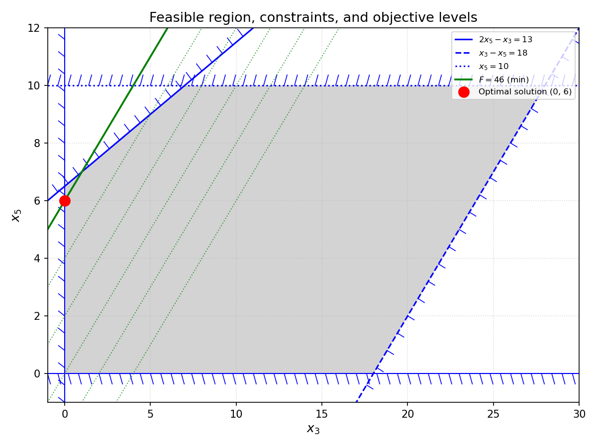
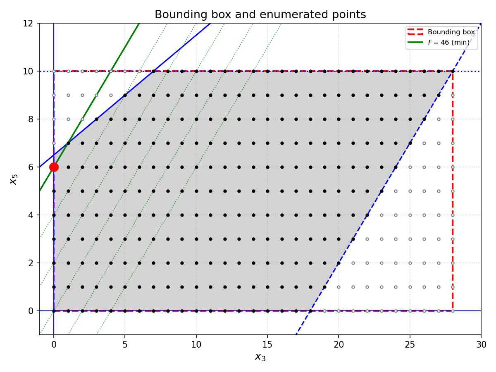

# Day 10: Factory


## Part 1

Since the Part 2 of Day 9 was a challenge, I decided to create a structure called `Machine` to hold the input data. This time it was a bit overkill, but I left it as is.

It looks like all first parts of each day are algorithmically easy, and brute force proved to be a decent way to deal with them. Day 10 was not an exception. However, from now on I (rightfully) decided to assume that not only are the inputs correct, but also that each line of any input has a unique valid solution (in terms of the resulting number). The algorithm relies on this—if a line had no solution or multiple ones, it could break. Thus, there are minimal checks on the input data.

For clarity, we can reformulate the puzzle as follows. There is a 10-bit integer (the indicators array) *A*, and a number of other 10-bit integers (the buttons) *B*₁, ..., *B*ₙ. We need to find a combination *Bᵢ* ^ *Bⱼ* ^ ... ^ *Bₖ* (where ^ denotes bitwise XOR) such that it equals *A*. It is enough to try all 2*ᴺ* combinations, where *N* is the number of buttons, since each button can be either pressed or not. At least one of them will work, and we must choose the one with the minimum number of toggles—i.e., minimize the size of the set {*i*, *j*, ..., *k*}.

```c++
std::pair<unsigned int, int> get_num_toggles(const Machine& machine) noexcept
{
	const auto& buttons = machine.buttons;
	std::pair<unsigned int, int> result = {0, buttons.size()+1};

	for (auto v = 0U; v < 1U << buttons.size(); v++) {
		auto inds = machine.indicators;
		auto nbuttons = 0;

		for (std::size_t i = 0; i < buttons.size(); i++) {
			if (v & (1U << i)) {
				inds ^= buttons[i];
				nbuttons++;
			}
		}
		if (0 == inds && nbuttons < result.second) {
			result = {v, nbuttons};
		}
	}

	return result;
}
```

This simple command calculates the maximum number of buttons in the main input:

```sh
cat ../10.txt | sed -e 's/[^(]//g' | sort | tail -1 | wc -c
```

In my case, it gave 14: 13 opening brackets and a newline character. So for each line of input, we have to check at most 2¹³ = 8192 combinations of buttons. That's not too much for 162 lines.

**Complexity estimation**

For each machine, we try all 2*ᴮ* combinations of buttons, where *B* is the number of buttons. For each combination, we apply the selected buttons and check the result. The total complexity is *O*(*M* × 2*ᴮ*), where *M* is the number of machines. The factor *B* per combination is absorbed by the exponential term. For the given input, *B* ≤ 13 and *M* = 162, which gives about 162 × 8192 ≈ 1.3 million combinations. This runs in a fraction of a second.

## Part 2

### Estimating brute force solution

Though it looks similar to Part 1, Part 2 is way too complicated to be solved by brute force. Let's take the third line of the sample:

```
[.###.#] (0,1,2,3,4) (0,3,4) (0,1,2,4,5) (1,2) {10,11,11,5,10,5}
```

Part 1 requires checking 2⁴ = 16 combinations of buttons. Part 2 is a different story. A single button press contributes as a '+1' to some of the required joltage levels. The first joltage level can be achieved by pressing some combination of the first three buttons (those that have 0 in their wiring schematics). The [general formula](https://en.wikipedia.org/wiki/Combination#Number_of_combinations_with_repetition) *C*(*n* + *k* − 1, *k*), where *n* is the number of buttons and *k* is the target joltage level, gives us the following numbers.

1. For the first joltage level: *C*(3 + 10 − 1, 10) = *C*(12, 10) = *C*(12, 2) = 12 · 11 / 2 = 66.
2. For the second joltage level: *C*(3 + 11 − 1, 11) = 78.
3. For the third joltage level: *C*(3 + 11 − 1, 11) = 78.
4. For the fourth joltage level: *C*(2 + 5 − 1, 5) = 6.
5. For the fifth joltage level: *C*(3 + 10 − 1, 10) = 66.
6. For the sixth joltage level: *C*(1 + 5 − 1, 5) = 1.

The whole solution would require checking a total of 66 × 78 × 78 × 6 × 66 × 1 = 159,011,424 combinations.

### ILP to the rescue

The good news is that there is a method for solving this class of problems with moderate complexity. It is called linear programming—or, in our case, [integer linear programming (ILP)](https://en.wikipedia.org/wiki/Integer_programming)—since we are solving the puzzle in integers.

The bad news is that we deliberately banned ourselves from using third‑party tools and must implement the approach by hand.

Before reading further, I'd recommend looking through at least a couple of chapters on the subject. A good linear programming textbook should contain some examples of formalizing a problem statement.

For this puzzle, we have the following formulation. For illustration, let's take the third line of the sample input.

* Our variables *x₀, x₁, ..., xₙ* are the numbers of presses of each button. In the example, we have 4 buttons, so the variables are: *x₀, x₁, x₂*, and *x₃*.
* Our [constraints](https://en.wikipedia.org/wiki/Constraint_(mathematics)) are:
  * The sum of the variables for buttons that affect a given joltage level must equal that level. For the first joltage level, this takes the form: 1·*x*₀ + 1·*x*₁ + 1·*x*₂ + 0·*x*₃ = 10. Here, pressing the fourth button does not affect the first joltage level, while pressing any of the other buttons increases it by one.
  * The values of the variables must be non-negative integers.
* Our objective function is the minimization of the total number of presses: *x*₀ + *x*₁ + *x*₂ + *x*₄ → min.

Let's write this as a complete system of equations and inequalities:

```
1·x₀ + 1·x₁ + 1·x₂ + 0·x₃ = 10
1·x₀ + 0·x₁ + 1·x₂ + 1·x₃ = 11
1·x₀ + 0·x₁ + 1·x₂ + 1·x₃ = 11
1·x₀ + 1·x₁ + 0·x₂ + 0·x₃ =  5
1·x₀ + 1·x₁ + 1·x₂ + 0·x₃ = 10
0·x₀ + 0·x₁ + 1·x₂ + 0·x₃ =  5
x₀ ≥ 0
x₁ ≥ 0
x₂ ≥ 0
x₃ ≥ 0

F = x₀ + x₁ + x₂ + x₃ → min
```

We build a custom ILP solver where the objective function and constraints are always in the same form. Let's put the constraints and the objective function aside for a moment and focus on the equations. Also, let's drop the variable names and work with the corresponding [augmented matrix](https://en.wikipedia.org/wiki/Augmented_matrix).

```
  1  1  1  0 10
  1  0  1  1 11
  1  0  1  1 11
  1  1  0  0  5
  1  1  1  0 10
  0  0  1  0  5
```

Our first goal is to transform it into diagonal form, like this:

```
 1  0  0 a₁ b₁ c₁
 0  1  0 a₂ b₂ c₂
 0  0  1 a₃ b₃ c₃
```

I'll explain the meaning of this transformation later.

The allowed transformations are:

1. Multiply or divide an entire row by some non‑zero integer. All values in the row must remain integers.
2. Add to a row a linear combination of other rows. A linear combination of rows is a sum of the results of their multiplication or division, as described in item 1.
3. If a row becomes all zeros, we remove it, because it is a linear combination of other rows and does not provide any additional information for the solution.

This approach is called [Gaussian elimination](https://en.wikipedia.org/wiki/Gaussian_elimination).

Let's return to our example.

Subtract row 0 from the other rows if they have a non-zero in column 0. Here, only row 1 is affected.

```
  1  1  1  0 10
  0  1  0 -1 -1
  0  1  0 -1 -1
  0  0  1  0  5
  0  0  1  0  5
```

Subtract row 1 from the other rows so that they have 0 in column 1. Row 2 becomes all zeros and is removed.

```
  1  0  1  1 11
  0  1  0 -1 -1
  0  0  1  0  5
  0  0  1  0  5
```

Finally, subtract row 2 (formerly row 3) from the other rows so that they have 0 in column 2. Row 3 becomes all zeros and disappears.

```
  1  0  0  1  6
  0  1  0 -1 -1
  0  0  1  0  5
```

Or, in equation form:

```
1·x₀ + 1·x₃ = 6     (1)
1·x₁ - 1·x₃ = -1    (2)
1·x₂ = 5            (3)
```

Here, the variables *x*₀, *x*₁, and *x*₂ are called **basic variables**, since they form a basis: a system where each basic variable is independent of the others. However, they may depend on the remaining variables, called **free variables**. Here, *x*₃ is a free variable. A variable is called 'free' because it can take any value, and the solution will still be valid as long as both it and the dependent basic variables also satisfy the constraints (see the inequalities above).

From now on, our goal is to choose a value for the free variable such that all variables are non‑negative integers and the objective function is minimized.

From equation (1), we conclude that *x*₁ = 6 − *x*₃. Since both *x*₁ and *x*₃ must be non‑negative integers, we have 0 ≤ *x*₃ ≤ 6.

From equation (2), we get *x*₂ = −1 + *x*₃, which implies *x*₃ ≥ 1.

Equation (3) imposes no constraints on *x*₃.

Thus, 1 ≤ *x*₃ ≤ 6.

Now let's see how *x*₃ affects the objective function.

*F* = *x*₀ + *x*₁ + *x*₂ + *x*₃ = (6 − *x*₃) + (−1 + *x*₃) + 5 + *x*₃ = *x*₃.

*F* reaches its minimum when *x*₃ is minimal, i.e., *x*₃ = 1.

The solution is:

* *x*₀ = 6 − *x*₃ = 5
* *x*₁ = −1 + *x*₃ = 0
* *x*₂ = 5
* *x*₃ = 1

In terms of presses: we press button `(0,1,2,3,4)` 5 times, button `(0,1,2,4,5)` 5 times, and button `(1,2)` once. Nice!

### Theory is good, but what about automation?

We will address the following four topics later in this section:

1. Diagonalizing the problem matrix.
2. Calculating free variable bounds.
3. Fixing free variable values.
4. Keeping it integer.

Of course, we are not the first to face this problem. There are several mature open-source libraries for integer linear programming that we could have used instead of writing our own solver.

**HiGHS** is arguably the best open-source option today. It provides simplex and interior point solvers for LP, MIP, and QP, and its performance [exceeds](https://maths.ed.ac.uk/research/data-decisions/optimization-and-operational-research/software) that of any other open-source linear optimization software in standard benchmarks. It is written in C++ and provides APIs for C, Python, Julia, and Rust, among others.

**Google OR-Tools** is a mature library for combinatorial optimization that includes its own LP/MIP solvers. It is widely used for scheduling and routing problems, and provides a CP-SAT solver that is extremely [competitive](https://www.linkedin.com/posts/payamrv_in-operations-research-solver-choice-is-share-7379562339593015296-jqA3/) when solution speed matters more than guaranteed optimality proofs.

**COIN-OR Cbc** is a solid open-source MILP solver that has been used in production for years. **GLPK** is another established option, particularly suitable for teaching and prototyping, though it can struggle with very large or complex problems. **SCIP** is a [well-regarded](https://ub01.uni-tuebingen.de/xmlui/bitstream/handle/10900/84296/Patrick%20Sittel%2C%20Thomas%20Schönwälder%2C%20Martin%20Kumm%20and%20Peter%20Zipf%09ScaLP%3A%20A%20Light-Weighted%20%28MI%29LP-Library.pdf?sequence=1&isAllowed=y#2#1) solver for both constraint and mixed-integer programming.

For C++ specifically, **ScaLP** provides a lightweight wrapper that unifies several solvers (CPLEX, Gurobi, SCIP, LPSolve) behind a single interface. **PRINTEMPS** is a [header-only](https://github.com/snowberryfield/printemps) metaheuristics solver that requires no external dependencies.

We deliberately did not use any of them. The reason is not that they are bad—they are excellent. The reason is that this repository is an educational project, and the point was to understand how an ILP solver works by building one. Using a library would have been the pragmatic choice for a production system, but it would have defeated the purpose of the exercise.

### Diagonalizing the problem matrix

We iterate over the matrix rows, keeping track of the current column in which we search for a non-zero cell. We start at row 0, column 0. We search down the column for any non-zero cell. If the row found is below the current row, we swap these rows.

If no such row is found, this means that the column contains a free variable. That's because a variable cannot be basic if it has zero coefficients in all rows from the current one down—its value is unconstrained by those equations, so it is free. In this case, we increment the column number and start over.

Eventually, we will either run out of rows or find a row containing a basic variable. In the latter case, we first divide all the values in the row by the GCD of its coefficients, so that the pivot becomes a positive integer. It is not necessarily 1, but it is the smallest positive integer we can get without introducing fractions. After that, we null out all the cells in the other rows for the current column. It's easy: we multiply the values of the current row by the coefficient in the target cell of the other row, and subtract the result from that other row.

```c++
static int gauss_forward_step(Matrix& matrix, int row, int col)
{
	int ncols = static_cast<int>(matrix[0].size());

	// We start from <row,col> and search downwards for the minimum
	// non-zero cell (equal to +-1 ideally).  If there is no such a cell
	// then the variable with index equal to row is not a basic one.  Thus
	// we must continue with the next column starting again with the row
	// supplied by the caller. Sooner or later we'll find something since
	// our firther steps guarantee that all rows are not empty.
	while (col < ncols - 1) {
		int min_abs_coeff = std::abs(matrix[row][col]);
		if (1 == min_abs_coeff)
			break;
		else if (0 == min_abs_coeff)
			min_abs_coeff = std::numeric_limits<int>::max();

		for (std::size_t swap_row = row + 1; swap_row < matrix.size(); swap_row++) {
			if (min_abs_coeff == 1)
				break;

			int curr_abs_coeff = std::abs(matrix[swap_row][col]);
			if (0 != curr_abs_coeff && curr_abs_coeff < min_abs_coeff) {
				std::swap(matrix[swap_row], matrix[row]);
				min_abs_coeff = curr_abs_coeff;
			}
		}
		if (min_abs_coeff < std::numeric_limits<int>::max())
			break;
		col++;
	}

	scale_down(matrix[row]);

	// Go through current column and set all coefficients to 0 (excluding
	// current row).
	// If some row goes all zeroes we delete it. Rows above the row we are
	// now in cannot zero out.
	const auto main_line_it = matrix.begin() + row;
	const auto& main_line = *main_line_it;
	auto main_coeff = main_line[col]; // It's more than 0, but may be more than 1
	for (auto it = matrix.begin(); it != matrix.end();) {
		if (it == main_line_it) {
			it++;
			continue;
		}

		auto& cur_line = *it;

		auto curr_coeff = cur_line[col];
		auto gcd = std::gcd(main_coeff, curr_coeff);
		auto main_factor = curr_coeff / gcd;
		auto curr_factor = main_coeff / gcd;

		auto all_zeroes = true;

		for (int c = 0; c < ncols; c++) {
			cur_line[c] = cur_line[c] * curr_factor - main_line[c] * main_factor;
			if (cur_line[c])
				all_zeroes = false;
		}
		if (all_zeroes) {
			it = matrix.erase(it);
		} else {
			scale_down(cur_line);
			it++;
		}
	}

	return col;
}
```

The function `gauss_forward_step` implements one step of this process. It takes the matrix and the current row and column, finds a pivot, normalizes the row, and eliminates the column in the other rows. If a row becomes all zeros, it is removed.

```c++
static void scale_down(std::vector<int>& line)
{
	auto ncols = line.size();

	// Scale row so that basic variable coefficient is 1.  If possible.
	// In any case its sign must be positive.
	std::size_t col = 0;
	for (; col < ncols; col++) {
		if (line[col])
			break;
	}

	int coeff = line[col];
	if (1 == coeff)
		return;
	int sign = coeff > 0 ? 1 : -1;
	int mingcd = std::numeric_limits<int>::max();
	if (-1 == coeff)
		mingcd = 1;
	else
		for (std::size_t c = col + 1; c < ncols; c++)
			mingcd = std::min(mingcd, std::gcd(coeff, line[c]));
	for (std::size_t c = col; c < ncols; c++)
		line[c] /= sign * mingcd;
}
```

The `scale_down` helper divides a row by the GCD of its coefficients. This keeps the numbers small and is essential for keeping everything in integers.

We end up with some number *N* of rows, which is usually (but not always) less than the initial number of rows. This number *N* is called the [rank](https://en.wikipedia.org/wiki/Rank_(linear_algebra)) of the matrix, and it equals the number of basic variables.

Finally, we scan the resulting matrix again. In each row, we find the first non-zero coefficient; the column it occupies is the position of a basic variable. All variables not in the list of basic variables are free.

### Geometric interpretation

Before we dive into the algorithm for finding bounds, let's step back and look at what we are actually doing.

After diagonalization and equalization, we have a system of linear equations. The basic variables are expressed in terms of the free variables. The constraints (non-negativity of all variables) become a set of linear inequalities on the free variables. The objective function also becomes a linear function of the free variables.

For the example machine

```
[.###] (0,2,3) (2) (0,2) (0) (0,1) (1,2) {39,10,42,11}
```

the matrix after diagonalization and equalization is:

```
  1  0  0  0  0  0 11
  0  1  0 -1  0  2 13
  0  0  1  1  0 -1 18
  0  0  0  0  1  1 10
```

The basic variables are *x*₀, *x*₁, *x*₂, and *x*₄. The free variables are *x*₃ and *x*₅. From the matrix, we can express the basic variables in terms of the free ones:

* *x*₀ = 11
* *x*₁ = 13 + *x*₃ − 2·*x*₅
* *x*₂ = 18 − *x*₃ + *x*₅
* *x*₄ = 10 − *x*₅

Since all variables must be non-negative, we get the following inequalities on *x*₃ and *x*₅:

* *x*₁ ≥ 0 → 2·*x*₅ − *x*₃ ≤ 13
* *x*₂ ≥ 0 → *x*₃ − *x*₅ ≤ 18
* *x*₄ ≥ 0 → *x*₅ ≤ 10
* *x*₃ ≥ 0
* *x*₅ ≥ 0

Geometrically, each inequality defines a half-plane. The set of all feasible solutions is the intersection of these half-planes, which is a convex polygon.



The picture shows all the inequalities on the plane. The shaded area is the feasible region. The objective function is *F* = *x*₀ + *x*₁ + *x*₂ + *x*₃ + *x*₄ + *x*₅. After substituting the basic variables, it becomes *F* = 52 + *x*₃ − *x*₅ (we will derive this later). We want to minimize it. The green lines are the level lines of the objective function.

Notice something important: the continuous minimum of *F* is not integer. The level line *F* = 45.5 touches the feasible region at *x*₃ = 0, *x*₅ = 6.5. But *x*₅ = 6.5 is not an integer, so it is not a valid solution. The integer minimum is at *x*₃ = 0, *x*₅ = 6, giving *F* = 46.

This is exactly why we cannot simply solve the linear program and round the result. Rounding *x*₅ = 6.5 to 6 or 7 might give an infeasible point or a suboptimal one. We need to search the integer points explicitly.

In a general-purpose ILP solver, we would use the simplex method or a branch-and-bound algorithm to find the optimal integer vertex. But we deliberately banned ourselves from using third-party tools, and implementing a full simplex method is a lot of work.

So we take a different approach. Instead of finding the exact polygon and its vertices, we build a **rectangular bounding box** around it. The box is defined by the upper bounds on each free variable. For our example, the bounds are *x*₃ ≤ 28 and *x*₅ ≤ 10, giving the box `[0, 28] × [0, 10]`. We then enumerate all integer points inside this box, check which ones satisfy the constraints, and pick the one with the smallest objective value.



The second picture shows the bounding box around the feasible region. The black dots are the integer points that satisfy all constraints. The white dots are the points inside the box but outside the feasible region; they are enumerated but rejected. The red dot is the optimal integer solution.

This approach is not optimal. The box can be much larger than the polygon, and we may enumerate many points that are not feasible. But for our problem, the number of free variables is small (typically 2 or 3), and the bounds are small (a few dozen at most). So the enumeration is fast enough.

Now the question is: how do we find these bounds? That is the subject of the next section.

### Calculating free variable bounds

Now that we know what we are looking for, let's see how to find the bounds.

We end up with equations of the following form:

1 × (some basic variable) + (a linear combination of free variables) = right-hand side value.

Or, in a form more convenient for our purposes:

some basic variable = right-hand side value − (a linear combination of free variables).

Using these equations, we can substitute all basic variables in the objective function with combinations of free variables and constants. This means that the objective function now depends only on the free variables and the right-hand side constants. Thus, we can eliminate the basic variables when finding bounds for the free variables.

We copy the diagonalized matrix and keep only the free variables and right-hand sides in the copy. Now we have a system of inequalities for the free variables, because we silently assume that for each equation,

(a linear combination of free variables) = right-hand side value − (the basic variable)

the value of (right-hand side + basic variable) is maximized when that basic variable is zero. There must be at least one inequality that contains a free variable with a positive coefficient (the others being non-negative, i.e., at least zero). Otherwise, we could take arbitrarily large values for the free variables and still satisfy all equations. That would mean there is no optimal solution, but we assume there is one by the definition of the puzzle.

Here comes the hardest part: in the example above, we used some mathematical reasoning on the inequalities to derive bounds for the free variables. Translating that reasoning into an algorithm is far from trivial. So instead of juggling inequalities, we use a coarse approach.

The function `find_bounds` is shown in two parts. The first part scans the inequalities and extracts bounds from those that have a single positive coefficient and no negative ones. The second part handles the case when some variables remain unbounded: it substitutes the known bounds into the remaining inequalities and calls itself recursively.

```c++
// We use only upper bounds, lower bounds are always 0.
static std::vector<int> find_bounds(const Matrix& free_vars)
{
	auto num_vars = free_vars[0].size() - 1;
	const auto MAXINT = std::numeric_limits<int>::max();
	std::vector<int> bounds(num_vars, MAXINT);

	for (const auto& line : free_vars) {
		int rhs = line.back();
		for (std::size_t v = 0; v < num_vars; v++) {
			auto coeff = line[v];
			// We process only vars with strictly positive coefficients
			if (coeff <= 0)
				continue;

			// coeff * var + rest <= rhs
			// var <= (rhs - rest) / coeff
			const auto it = std::find_if(line.rbegin() + 1, line.rend(),
				[](auto x) { return x < 0; }
			);
			// If some else variable is present with a negative
			// sign then we can't fix upper limit on the current
			// variable.
			if (it == line.rend())
				bounds[v] = std::min(bounds[v], rhs / coeff);
		}
	}

	#ifdef AOC_DEBUG
	std::cout << "Bounds: " << bounds << '\n';
	#endif

	std::size_t unbounded;
	for (unbounded = 0; unbounded < num_vars; unbounded++) {
		if (MAXINT == bounds[unbounded])
			break;
	}

	if (unbounded == num_vars)
		return bounds;
	
	// ...
}
```

1. For each inequality, we find a variable with a positive coefficient. If any other variable has a negative coefficient, we skip to the next inequality. Otherwise—and there must be at least one such inequality—the left-hand side is at least (coefficient × variable). Therefore, this variable cannot exceed the right-hand side divided by its coefficient. Hence our bound estimate: free variable ≤ right-hand side / (coefficient of the free variable). We don't bother with the lower bound and simply keep the initial constraint that all variables (including free ones) are non-negative.

2. If, after examining all inequalities, we still have some unbounded free variables, we iterate over the inequalities again. This time, for each bounded free variable that has a negative coefficient, we substitute the variable with its upper bound and recalculate the right-hand side. There is no need to handle the case of non-negative coefficients, since in that case we would use the lower bound, which is already zero and is not taken into account anyway. Moreover, if we don't substitute free variables with non-negative coefficients, we don't even need to remember their bounds. They will be recalculated correctly in the next pass.

3. Rinse and repeat with the new inequalities until all free variables have some upper bounds

```c++
// We use only upper bounds, lower bounds are always 0.
static std::vector<int> find_bounds(const Matrix& free_vars)
{
	// ...

	// Some bounds stay unlimited, so, substitute bounded free variables with their upper bounds and re-run.
	// Thus we take out one unbounded free variables at a pass.
	Matrix new_free_vars = free_vars;

	for (auto& line : new_free_vars) {
		// No unbounded var in this inequality
		if (0 == line[unbounded])
			continue;

		for (std::size_t b = 0; b < num_vars; b++) {
			// Skip unbounded variables
			if (bounds[b] == MAXINT)
				continue;

			// We take a variable into account only if it comes
			// with a negative factor. Variables with positive
			// factors can always be set to 0 thus rendering no
			// effect on bounds.
			// In any case the factor for the variable is zeroed.

			if (line[b] < 0)
				line.back() -= bounds[b] * line[b];
			line[b] = 0;
		}
	}
	#ifdef AOC_DEBUG
	std::cout << "New free variables\n" << new_free_vars << '\n';
	#endif

	return find_bounds(new_free_vars);
}
```

The function `find_bounds` implements this logic. It takes the matrix of free variables and returns a vector of upper bounds. If some variables are still unbounded after the first pass, it substitutes the known bounds into the inequalities and calls itself recursively.

### Example: Deriving Bounds for Free Variables

Let's again consider the machine

```
[.###] (0,2,3) (2) (0,2) (0) (0,1) (1,2) {39,10,42,11}
```

After diagonalization and equalization, we obtain a system with two free variables, *x*₃ and *x*₅. The augmented matrix (excluding the basic variables) is:

```
  0  0 11
 -1  2 13
  1 -1 18
  0  1 10
```

Each row corresponds to an inequality of the form `(linear combination of free variables) ≤ right-hand side`.

---

**Iteration 1.** For each inequality, we look for a variable with a positive coefficient, provided all other coefficients are non-negative. If any other coefficient is negative, we skip that inequality (it cannot give a valid upper bound at this step).

| Row | Coefficients | RHS | Positive coeff. | All other coeffs non-negative? | Bound |
| --- | ------------ | --- | --------------- | ------------------------------ | ----- |
| 1 | 0, 0 | 11 | — | — | — |
| 2 | -1, 2 | 13 | *x*₅ | No (*x*₃ has -1) | — |
| 3 | 1, -1 | 18 | *x*₃ | No (*x*₅ has -1) | — |
| 4 | 0, 1 | 10 | *x*₅ | Yes (0 is non-negative) | *x*₅ ≤ 10 |

After this pass, we have a preliminary bound: *x*₅ ≤ 10.

We still have no bound for *x*₃, so we proceed to the next iteration.

---

**Iteration 2.** Now we substitute the known bound for *x*₅ into the inequalities that we skipped earlier (those with a negative coefficient for *x*₅).

- Row 2: `−x₃ + 2·x₅ ≤ 13`. Substitute *x*₅ = 10: `−x₃ + 20 ≤ 13` → `−x₃ ≤ −7` → `x₃ ≥ 7`. This gives a lower bound, not an upper one, so it does not help.
- Row 3: `x₃ − x₅ ≤ 18`. Substitute *x*₅ = 10: `x₃ − 10 ≤ 18` → `x₃ ≤ 28`. This gives an upper bound for *x*₃.

Now we have a bound for *x*₃: *x*₃ ≤ 28. Since *x*₅ ≤ 10 is already known, all free variables are bounded. The algorithm terminates with the final bounds:

> **Bounds: [28, 10]**

This means *x*₃ can range from 0 to 28, and *x*₅ from 0 to 10. These bounds are then used to enumerate all valid combinations of the free variables.

### Fixing free variable values

The idea is now straightforward: we evaluate the objective function for every possible combination of values of the free variables, each bounded between 0 and its upper limit. We skip any combination that makes the objective function negative (which shouldn't happen, since it's a sum of non-negative terms). Otherwise, we keep the minimum value found.

However, we don't know in advance how many free variables there are, so we don't know how many nested loops we would need to iterate over all possible combinations. So we use recursion. The recursion builds a full vector of values for all free variables, iterating only over the possible values of the most recently added variable at each step. If the vector's size equals the number of free variables, it evaluates the objective function. Otherwise, it recurses, pushing the values of the next free variable onto the vector.

```c++
static std::vector<int> fix_free_vars(Matrix& free_vars, int basic_factor)
{
	auto num_vars = free_vars[0].size() - 1;
	// In the specific case of our riddle the objective function is
	// x_1 + x_2 + ... + x_n, i.e. every variable is counted once. Hence
	// initialization with 1's.
	// But this is true if basic variables equal 1. Otherwise we have to
	// account for this initializing all objective coefficients with
	// basic_factor.
	std::vector<int> objective_coeffs(num_vars, basic_factor);

	for (const auto& line : free_vars) {
		for (std::size_t c = 0; c < num_vars; c++) {
			objective_coeffs[c] -= line[c];
		}
	}
	#ifdef AOC_DEBUG
	std::cout << "Objective coeffs: " << objective_coeffs << '\n';
	#endif

	auto bounds = find_bounds(free_vars);

	std::vector<int> best_solution;
	int best_objective = std::numeric_limits<int>::max();

	std::function<void(const std::vector<int>&)> try_free_vars_combo;
	try_free_vars_combo = [
		num_vars, basic_factor,
		&free_vars, &objective_coeffs, &bounds, &best_solution, &best_objective,
		&try_free_vars_combo
	](const std::vector<int>& values)
	{
		if (values.size() < num_vars) {
			std::vector<int> new_values = values;
			new_values.emplace_back(0);
			auto var_pos = values.size();
			for (auto val = 0; val <= bounds[var_pos]; val++) {
				new_values.back() = val;
				try_free_vars_combo(new_values);
			}

			return;
		}

		for (const auto& line : free_vars) {
			int lhs = 0;
			for (std::size_t v = 0; v < num_vars; v++) {
				lhs += line[v] * values[v];
			}
			auto diff = line.back() - lhs;
			if (0 > diff)
				return;
			if (diff % basic_factor)
				return;
		}

		int objective = 0;
		for (std::size_t v = 0; v < num_vars; v++) {
			objective += objective_coeffs[v] * values[v];
		}

		if (objective < best_objective) {
			best_objective = objective;
			best_solution = values;
		}
	};

	try_free_vars_combo({});
	#ifdef AOC_DEBUG
	std::cout << best_objective << ": " << best_solution << '\n';
	#endif

	return best_solution;
}
```

The function `fix_free_vars` implements this. It first computes the objective coefficients, then calls `find_bounds` to get the upper bounds, and finally recurses over all combinations. For each complete combination, it checks that the constraints are satisfied and that the right-hand side is divisible by the common basis factor. If so, it evaluates the objective function and keeps the minimum.

### Keeping it integer

All of the above works if we implement it using floating‑point numbers and hope we don't run into rounding errors. Another option is to use rational numbers—i.e., pairs of integers: a numerator and a denominator. However, this would mean either using [boost::rational](https://www.boost.org/doc/libs/latest/libs/rational/rational.html) (which is forbidden) or implementing rational numbers from scratch. I decided that reimplementing rational numbers for a limited ILP solver would be overkill. So I stuck with pure integers. And here is how that decision changes things.

1. If we just use integers and always multiply numbers, we may end up with quite large right‑hand sides. So the algorithm uses division by the [greatest common divisor (GCD)](https://en.wikipedia.org/wiki/Greatest_common_divisor) hither and yon.
2. Diagonalizing the problem matrix:
   * When searching for a row with a non‑zero cell in the current column, I gave priority to cells with the smallest absolute values, ideally 1 or -1.
   * After each transformation, the modified row is checked to see if it can be divided entirely by some integer. This is done by computing the GCD of all its cells. If the GCD is greater than 1, the row is divided by it.
   * When nulling out a value in column *C* of row *R*₁ by subtracting row *R*₂, I compute:
   
      *R*₁ × (*R*₂ / *GCD*(*R*₁, *R*₂)) - *R*₂ × (*R*₁ / *GCD*(*R*₁, *R*₂)). This reduces the final multiplier for *R*₁.
   * At the end of the Gaussian elimination, the coefficients of the basic variables may differ. I equalize them to their [least common multiple (LCM)](https://en.wikipedia.org/wiki/Least_common_multiple) using GCD again.
3. Fixing free variable values:
   * Since the coefficients of the basic variables are no longer guaranteed to be 1, I initialize the objective function coefficients with the common basic factor instead of 1.
   * When evaluating the objective function for a given set of free variable values, I also check that the result is divisible by the common basic factor. Otherwise, the solution does not provide a valid integer result.

With all these tricks applied, I ended up with a maximum common basic factor of 36 and a maximum right‑hand side value of 815. Small enough to fit in 32-bit integers.

### Complexity estimation

Let *M* be the number of machines, *R* the number of joltage levels per machine (which equals the number of indicators), *C* the number of buttons per machine, and *F* the number of free variables after diagonalization.

Building the matrix for one machine takes *O*(*R* × *C*). Diagonalizing it takes *O*(*R*² × *C*) in the worst case. Equalizing the basis coefficients takes *O*(*R* × *C*). Finding the bounds takes *O*(*F* × *R* × *C*) per pass, and the recursion may add a factor of *F*, but in practice *F* is small.

The enumeration of free variable combinations is the dominant part. For each combination, we check all constraints, which takes *O*(*R* × *F*). The number of combinations is the product of (bound + 1) over all free variables. So the enumeration takes *O*(∏(*boundᵢ* + 1) × *R* × *F*).

The overall complexity is exponential in the number of free variables. For the given input, *F* is at most 3, and the bounds are small. The largest bounding box in my input was `[432, 10, 216]`, which gives 433 × 11 × 217 ≈ 1 million points. The next largest were `[15, 36, 60]` (36,112 points), `[23, 23, 30]` (17,856 points), `[107, 88]` (9,612 points), `[18, 20, 18]` (7,581 points), and `[13, 13, 15]` (3,136 points). Everything else was below 3,000 points. So the enumeration is fast enough for the given input.

For a larger number of free variables or larger bounds, this approach would not scale, and a proper branch-and-bound or simplex method would be needed.

[<< To Day 9](day-09.md)   [To Day 11 >>](day-11.md)
